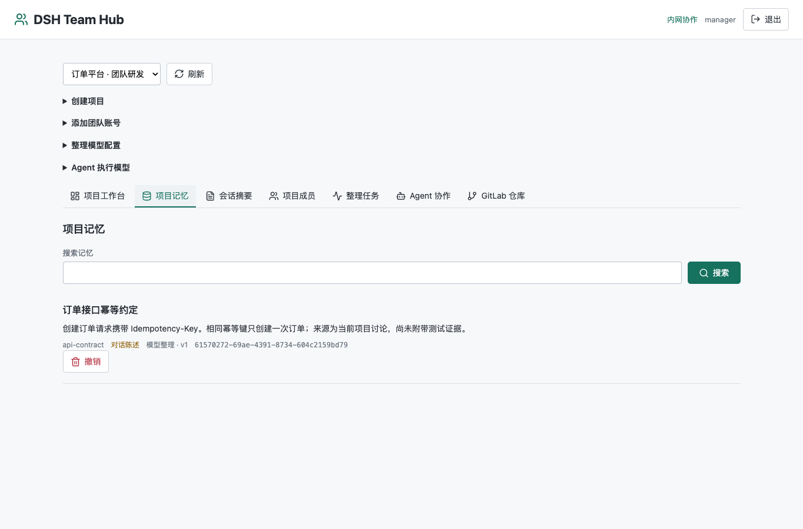
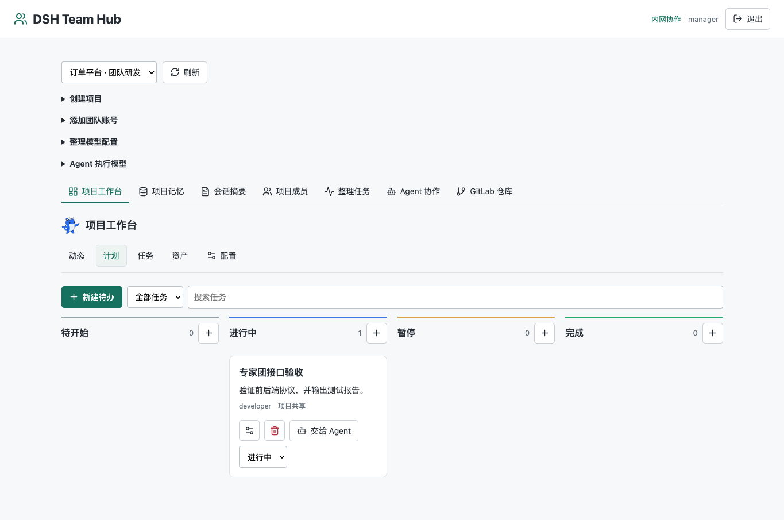
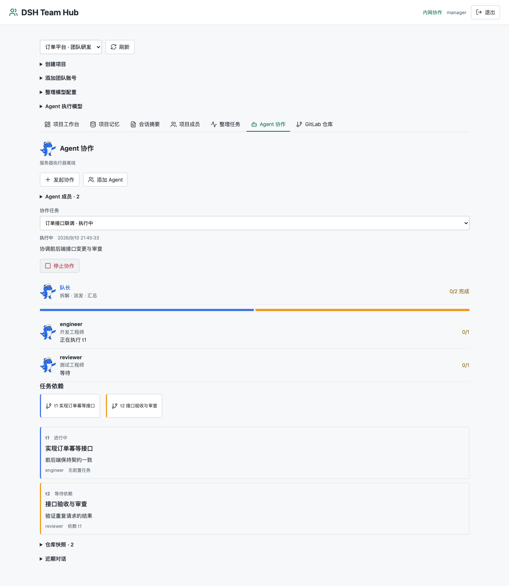
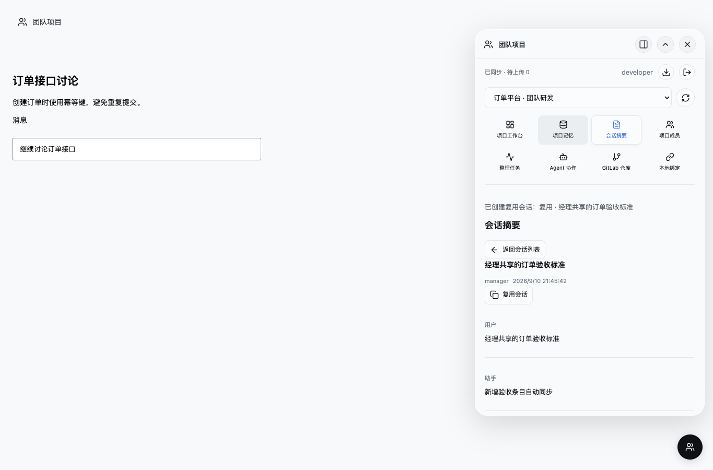
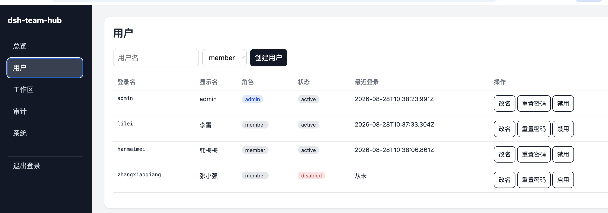

# dsh-team-hub

A team collaboration service for [DeepSeek Harness](https://github.com/deepseek-ai/DeepSeek-Harness). Repository: <https://github.com/Hanchenk/dsh-team-hub>.

[中文 README](README.md)

It has two modes:

- **Team collaboration**: a standalone `team` service plus the Desktop plugin `dsh-plugin-team-hub`. Members sync sessions and project memory, use a project workbench, and run tasks through a server-side AgentTeams supervisor.
- **Single-host gateway**: sits between browsers and one local DSH Web instance. It adds login, roles, workspace isolation, RPC and WebSocket filtering, an admin console, and audit logs without modifying DSH itself.

The hub package is v0.2.7. Plugin source lives in `packages/dsh-plugin-team-hub` and is currently `0.1.0-alpha.15`.

> This is an independent community project and is not an official DeepSeek product.

## Team collaboration

Current capabilities:

- Five organization roles, project membership, and session binding
- Model summarization and project memory, published automatically after validation
- Project workbench: activity, kanban, tasks, assets, instructions, expert packs, and scheduled automations
- A resident AgentTeams supervisor with multiple GitLab repositories per project. Plans require approval before execution. The service does not push, open merge requests, or deploy automatically
- Ed25519-signed plugin releases and client auto-update

Trusted LAN pilots may use HTTP. Team mode uses PostgreSQL and is configured separately from the gateway below.

### Screenshots

Project memory, the workbench, and Agent collaboration:







Session summaries in the Desktop plugin:



Guides:

- [Team collaboration](docs/team-collaboration.md)
- [AgentTeams and multiple repositories](docs/agent-teams.md)
- [Project workbench](docs/workbuddy-integration.md)
- [Plugin auto-update](docs/plugin-auto-update.md)

### Requirements

- Node.js 22.19 or newer
- PostgreSQL 15 or newer
- Optional Docker for Compose deployment and the agent runtime

### Local start

```sh
npm ci
npm run build:plugin
export TEAM_DATABASE_URL='postgresql://<user>:<url-encoded-password>@127.0.0.1:5432/teamhub'
export TEAM_INITIAL_PASSWORD='<at-least-10-characters>'
node bin/dsh-team-hub.js team init admin
unset TEAM_INITIAL_PASSWORD
npm run team
```

The default URL is `http://127.0.0.1:3090`. `team init` creates an account with both system-admin and project-manager roles. The first login must change the password.

Add another account:

```sh
export TEAM_INITIAL_PASSWORD='<initial-password>'
node bin/dsh-team-hub.js team user-add developer developer
unset TEAM_INITIAL_PASSWORD
```

Roles may be comma-separated. LAN deployment and model configuration are documented in [team collaboration](docs/team-collaboration.md). The Compose example is `compose.team.yml`; do not commit `.env.team`.

Build the plugin with `npm run build:plugin`. Installation and release steps are in the plugin [README](packages/dsh-plugin-team-hub/README.md) and [auto-update guide](docs/plugin-auto-update.md). The signing private key is `.plugin-signing/private.pem` and is gitignored.

## Single-host gateway

The gateway turns a loopback, single-user DSH Web instance into a login-gated LAN entry point with per-member isolation.

```bash
npm install -g dsh-team-hub
dsh-team-hub init alice bob
dsh-team-hub start
```

Initialization prints the admin password once. Members open `http://<server-lan-ip>:3090`; the admin console is `/admin` on the same origin. Every user must change the initial password on first login.



```bash
dsh-team-hub init [--port 3090] [--upstream http://127.0.0.1:3080] [member ...]
dsh-team-hub start
dsh-team-hub selftest
dsh-team-hub user add <name> [--role member|admin]
dsh-team-hub user disable <name>
dsh-team-hub user enable <name>
dsh-team-hub user reset-password <name>
dsh-team-hub patch status|apply|rollback [--dsh-root <path>]
dsh-team-hub service install|status|uninstall
```

Runtime data defaults to `~/.dsh-team-hub`. Override it with `DSH_TEAM_HUB_HOME`. The gateway needs Node.js 22 or newer and a reachable DSH Web instance, default `http://127.0.0.1:3080`. The v0.1 gateway is intended for a trusted LAN and should not be exposed directly to the public internet.

- [Security](docs/security.md)
- [Admin console](docs/admin-console.md)
- [Deployment](docs/deployment.md)
- [Compatibility](docs/compatibility.md)

After upgrading DSH, run `dsh-team-hub selftest` and `npm test`. Unknown RPC methods stay denied by default.

## Development

```bash
npm ci
npm test
npm run test:team
```

## License

MIT
