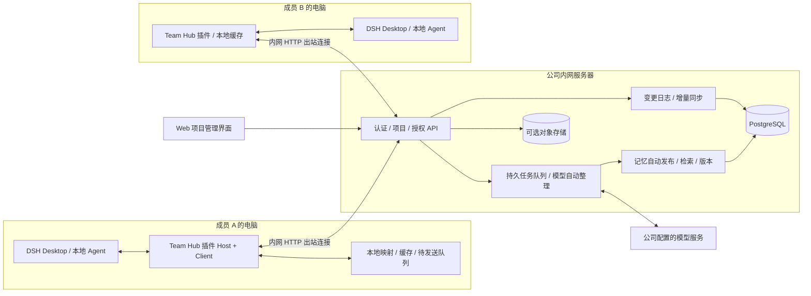
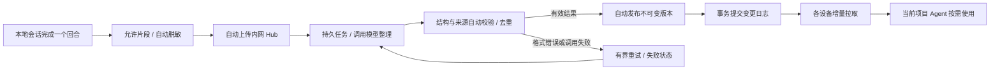

# DSH 团队协作服务与桌面插件实现方案

分析日期：2026-09-09。本文基于本地代码检查，属于可行性分析及待实施设计，不表示下文功能已经交付。

本版按已确认需求调整：项目记录由模型自动整理、自动发布、自动同步，无需人工审核或逐条确认；共享服务部署在公司内网机器，Desktop 与 Hub 之间使用 HTTP，不要求 HTTPS、证书或公网域名。

**实施进度（2026-09-09）：** 已在 `dsh-team-hub` 新增独立 `team` 服务入口和 `packages/dsh-plugin-team-hub` Alpha 插件，实现 PostgreSQL 存储、五类角色、项目邀请、会话绑定、模型自动整理与发布、增量同步和项目限定的 Agent 记忆工具。已完成数据库/API、Cordis 加载及浏览器联调；真实打包 Desktop 安装和公司模型接入仍待验证。下面仍保留完整目标方案，不能将全部章节视作已实现；具体交付范围及未实现项见 [内网协作 Alpha 使用说明](/Users/steven/Desktop/Project/dsh-team/dsh-team-hub/docs/team-collaboration.md)。

## 1. 可行性结论

**可以实现。推荐采用“每人本地运行 DSH Desktop + 一个公司内网协作服务 + 一个可安装的 DSH 插件”，由服务端统一调用模型自动整理会话摘要与项目记忆，直接发布并同步给项目成员。**

现有 `dsh-team-hub` 可以作为服务端演进基础，但不是增加几个角色、放开会话过滤就能完成。它当前解决的是“多人访问同一个 DSH Web 实例，并隔离个人工作区”，你的目标则是“多个独立 Desktop 实例，通过项目共享知识”。两者的数据归属、认证、同步及运行边界不同。

建议产品职责如下：

| 组成 | 职责 |
| --- | --- |
| DSH Desktop | 每人在本机运行 Agent、操作代码和保存原始对话；继续使用现有桌面产品 |
| `dsh-team-hub` 内网服务 | 账号、组织角色、项目、邀请、项目成员权限、模型自动整理、记忆自动发布、版本、同步和审计 |
| `dsh-plugin-team-hub`，拟新增 | 安装到 Desktop 当前 profile；连接 Hub、绑定项目、采集成果、同步缓存、检索和注入记忆、提供协作界面 |
| Git 平台 | 代码版本、分支、提交、合并请求；项目记忆引用这些资产，不能替代 Git |

原则上无需修改 Desktop 或其上游源码。插件加载、后台采集、跨会话的项目隔离和自动注入需要先通过技术验证，再承诺所有 Desktop 模式与版本的完整兼容性。

## 2. 当前代码实际具备什么

### 2.1 分析基线

- 用户所指的 `dsh-desktop` 在当前目录中实际名为 `yemast-desktop/`。
- Desktop Git 提交：`b39ffbf562`；正式包 `dsh-plugin-desktop@2.0.6`，Beta 包 `2.0.6-beta.1`。
- Desktop 正式包声明的主要 DSH 依赖为 `0.1.2-rc.1`；仓库同时保存其他版本的运行时压缩包，不能混用其接口。
- Hub Git 提交：`24eb47e`；版本 `0.2.7`。
- Desktop 的 `deepseek-harness/` 子模块当前未展开，且没有根 `node_modules/`。因此检查了桌面自有源码，以及 `vendor/dsh-runtime/0.1.2-rc.1/` 中运行时包的类型和实现，没有完成 Desktop 启动联调。

### 2.2 能力与缺口

下表中的路径相对于本文所在目录。具体代码定位见第 13 节。

| 能力 | 当前证据 | 对目标的判断 |
| --- | --- | --- |
| 账号与登录 | Hub `src/users.mjs`、`src/auth.mjs`，scrypt 密码哈希、首次改密、Cookie 登录、禁用用户 | 可复用账号处理思路；需要数据库及插件设备认证 |
| 角色 | Hub `src/config.mjs` 仅接受 `admin`、`member`；`disabled` 是账号状态 | 五类业务角色尚未实现；不能把角色改成五个字符串后继续沿用现有分支 |
| 工作区/会话归属 | `src/policy.mjs` 使用 `workspaceOwner`、`sessionOwner`，按服务器上的用户目录判断 | 是单宿主个人归属，不是多设备项目成员关系 |
| 会话访问限制 | RPC 响应及 WS 事件按个人 owner 过滤 | 现有策略主动阻止成员互看会话；需要独立的项目共享数据 API |
| 管理和审计 | `admin-ui/`、`src/admin-api.mjs`、`src/audit.mjs` | 管理入口和日志结构可复用，增加项目维度和业务操作 |
| 共享知识 | README 提到共享目录和知识演进路线 | 未发现项目记忆 CRUD、模型自动整理、版本、检索、跨设备分发实现；共享路径配置不等于知识同步 |
| 项目与邀请 | 当前 `src/` 未发现对应领域模型或路由 | 需要新增 |
| 插件安装能力 | Desktop 有 DSH package/profile 机制和 `desktopPnpm` 服务 | 支持独立插件交付；Hub 当前 package 只有 CLI，尚不是可加载的 DSH 插件 |
| 插件界面 | 社区市场源码通过 `sidebar.footer.action`、`shell.overlay` 等 slot 组合界面 | 可参考相同方式提供“团队项目”入口，避免接管桌面整体布局 |
| Host 路由 | Desktop 和市场插件使用 `ctx.webServer.register()` | 可提供插件自己的本地 API，处理界面与后台同步之间的通信 |
| 会话采集 | 已检查运行时 `dsh-session` 的 `session/created`、`session/event`、`session/flush` | 存在采集入口，但事件监听本身不保证上传可靠性 |
| 历史补偿读取 | `dsh-session-query` 提供 `listSessions()`、`readSession()`、`readSurface()` 等 | 可用于恢复和按需导出，需确认目标 profile 实际注入此服务 |
| 模型上下文扩展 | `dsh-system-prompt` 有 `context()`、`section()` 和带 scope 的组装过程 | 可以按 Agent 所属项目注入上下文；不能使用一个全局“当前项目”变量 |

### 2.3 不能直接照搬的部分

1. **旧网关的 admin 是高权限宿主访问者。** `server.mjs` 对 admin 的 RPC 直接代理；新业务角色必须走独立授权，技术总监不能简单映射成这个 admin。
2. **旧 Hub 启动依赖上游 DSH。** 启动会刷新工作区归属、为成员创建工作区，并尝试修改上游 settings bundle。新协作服务模式必须与这些逻辑解耦，没有上游 DSH 也能独立启动。
3. **不能把原始 WS 广播当成跨设备同步。** 其中包含审批、问题、任务和运行状态；共享阅读不能授予控制他人 Agent 的能力。
4. **当前 JSON 文件存储不适合协作事务。** `config.json`、`sessions.json` 的整体读写不能承担邀请并发、记忆版本和多实例同步。
5. **现有脱敏不是会话正文脱敏。** `audit.mjs` 按字段名处理 token/password 等字段，并不检查自由文本中包含的密钥、日志或个人信息。
6. **部分文档落后于代码。** `docs/plugin-development.md` 中有 `desktopPnpm.installPlugin()` 示例，但当前 `src/pnpm.ts` 暴露的是 `run()`、`runPlugin()`、`runExternalMarketPluginInstall()`。市场 README 仍说尚未实现，但源码已有界面和安装相关代码。插件应依据当前类型、源码和冒烟测试接入，不能照抄旧示例。
7. `dsh-community-fabric` 的统一 manifest/capability/event RFC 仍不是已交付的通用运行时。新插件使用现有 DSH/Cordis 接口。

### 2.4 本次验证范围

使用 Node.js `v22.23.1` 运行 Hub 测试。首次运行因缺少 `ws` 依赖，48 项通过、1 项失败；执行 `npm install --ignore-scripts --no-package-lock --no-audit --no-fund` 补齐依赖后，现有 **49 项全部通过**，没有修改 package 元数据或业务源码。

以上为初次分析时的测试结果，主要覆盖现有账号、策略、过滤和管理逻辑，不证明新增模型整理、内网 HTTP 接入及协作功能已经可用。本次仅调整文档，未重新运行业务测试。未运行需要真实 DSH 上游的 `selftest`、`acceptance`，也未构建或启动 Desktop。本方案中的自动采集与注入能力目前有代码接口依据，仍需第 11 节的 P0 实机验证。

## 3. 会话共享还是项目记忆共享

### 3.1 推荐采用三层信息

| 层级 | 内容 | 推荐默认行为 | 作用 |
| --- | --- | --- | --- |
| 项目记忆 | 模型从对话提取的需求、架构决策、接口约定、排障结论、测试规则、可复用步骤，附来源与证据状态 | 模型整理完成后自动发布，同步给所有当前项目成员的已授权实例 | 让后续 Agent 复用已有成果，并判断结论是否适用 |
| 会话摘要 | 作者、主题、完成事项、阻塞点、关联提交及记忆引用 | 项目绑定后自动整理和共享，标注“模型自动整理” | 团队了解进展、发现已有研究和解决方案 |
| 原始会话只读副本 | 已脱敏的用户/助手消息，以及按需选取的工具结果 | 默认不上传；项目可选启用，并明确提示参与者 | 需要时查看讨论依据和问题上下文 |

核心区别：**同步到设备不等于把所有内容都塞进模型上下文。** 已发布记忆可缓存，真正进入某次请求的内容应由当前项目、任务相关性、代码版本和上下文预算筛选。

不建议默认全量复制每个人的原始对话：噪声和存储增长快，可能包含失败猜测、凭据、本机路径和大量工具输出；即便复制成功，也不意味着其他 Agent 会主动利用其中的知识。

### 3.2 若确实需要“所有项目会话都可见”

增加项目策略 `sessionSharing = summary | transcript`。选择 `transcript` 时，对新建且明确绑定本项目的会话自动生成共享只读副本；历史私人会话需作者主动选择后才加入。策略修改应记录生效时间，并向在线、离线后重连的成员展示。

共享视图与本地原始会话分开：成员可以检索、查看和引用，不能远程续写他人的会话、替他人批准工具调用或恢复他人的运行环境。需要继续研究时，从选定摘要或片段创建自己的新会话，并保留来源。

“完整会话”在产品中应解释为可阅读的会话记录，不承诺原始运行时字节级克隆。附件按独立权限和大小限制上传；模型隐藏推理、凭据、系统内部状态和未经允许的文件内容不作为共享内容。

### 3.3 记忆需要可治理

建议首批分类：`requirement`、`architecture`、`api-contract`、`implementation`、`bugfix`、`testing`、`workflow`。

每条记忆至少包含：标题、结论、适用条件、来源会话/片段、贡献成员、整理模型与版本、证据状态、发布状态、版本，以及可选的模块、仓库、分支、commit、任务编号、失效日期。不设置审核人或待审核状态。

证据状态使用 `observed`（来源中有执行/测试结果）、`reported`（来源中仅有成员陈述）、`uncertain`（推测或证据不足），冲突用独立标志表达。自动发布不等于事实已验证；模型不得把“计划实现”整理成“已实现”，也不能凭空增加测试或提交依据。

例如，“订单重复提交使用 Idempotency-Key，已在提交 abc123 验证；只适用于 order-api v2”比“今天修复了重复提交”更适合复用。检索应优先返回适用于当前版本且已验证的结论，并提示存在的冲突。

## 4. 总体架构



Hub 不运行成员的开发 Agent，不要求成员电脑开放入站端口。代码执行和个人聊天仍由各自 Desktop 完成；项目记录整理由 Hub 的后台 worker 统一调用公司配置的模型服务，无需收集每个人的模型密钥。统一模型凭据只保存在服务器，插件不接收该凭据。

模型地址可指向内网部署的兼容 API 或公司已有模型网关。若公司选择外部模型 API，整理输入会发送到该提供方，Hub 部署在内网不代表模型调用也在内网；模型连接使用提供方要求的协议，不改变 Desktop 到 Hub 使用 HTTP 的方案。需要完全不出内网时，将模型地址配置为内网服务。

第一版建议使用 Node.js 22、当前 ESM 风格、现有 HTTP 服务组织方式、PostgreSQL，以及插件本地 SQLite。服务端先做模块化单体，API 与数据库任务 worker 可以同一部署维护；完整会话附件启用后再接内网 S3 兼容对象存储。

先采用带项目、状态、标签约束的关键词检索。中文需验证分词或使用受控的子串匹配起步，不能假定 PostgreSQL 默认英文全文索引能解决中文搜索。向量检索、独立搜索服务和 Redis 在规模或召回效果需要时再增加。

## 5. 角色和权限设计

### 5.1 分开组织角色、项目成员和运维权限

组织内提供五种业务角色：技术总监 `technical_director`、产品经理 `product_manager`、项目经理 `project_manager`、开发工程师 `developer`、测试工程师 `qa_engineer`。

同一用户可以具备多个经授权的组织角色，在不同项目承担不同项目角色。组织角色决定“能否创建项目、能否被授予某类项目职责”；项目成员关系决定“能读哪些项目的数据”。

另外保留独立的 `platform_admin` 运维权限，用于账号与系统配置，不属于上述五类业务职务，也不自动获得新协作 API 的所有项目内容访问权。具有服务器或数据库权限的运维仍可能读取底层数据，应用权限不等于对运维人员的密码学隔离。

默认：技术总监只有加入项目后才读取该项目内容。若公司需要全项目监督，可增加明确授权的 `org.project_audit` 权限，并记录跨项目访问审计，不由职位名称隐式推导。

### 5.2 默认业务权限矩阵

除“创建项目”外，下表均以账号启用、属于同一组织、具有有效项目成员关系为前提。“项目负责人”是由项目经理承担的项目所有权，不额外创造第六种职务。

| 操作 | 技术总监 | 产品经理 | 项目经理 | 开发工程师 | 测试工程师 |
| --- | --- | --- | --- | --- | --- |
| 创建项目 | 默认否，可授予兼任项目经理角色 | 否 | 是 | 否 | 否 |
| 查看项目成员、已发布记忆、共享摘要 | 是 | 是 | 是 | 是 | 是 |
| 查看项目允许共享的会话副本 | 是 | 是 | 是 | 是 | 是 |
| 邀请/移除成员、修改一般项目设置 | 否 | 否 | 是，受角色授予上限约束 | 否 | 否 |
| 本人项目会话参与自动整理和发布 | 是 | 是 | 是 | 是 | 是 |
| 补充记录、添加纠错说明 | 是 | 是 | 是 | 是 | 是 |
| 撤回本人上传的源片段并触发记忆重算 | 是 | 是 | 是 | 是 | 是 |
| 撤销/回滚任意项目记忆版本 | 是 | 否 | 是 | 否 | 否 |
| 调整项目自动整理频率和预算，限组织上限内 | 否 | 否 | 是 | 否 | 否 |
| 查看项目管理审计 | 是 | 否 | 是 | 否 | 否 |
| 归档项目、移交负责人 | 否 | 否 | 仅当前项目负责人 | 否 | 否 |
| 停止他人 Agent、回应他人执行审批 | 否 | 否 | 否 | 否 | 否 |

五类角色用于项目管理与数据操作授权，不设置分类审核职责。模型输出通过结构、来源和内容规则校验后，由限定项目范围的系统 worker 自动发布，不需要任何角色点击确认。成员可事后补充或纠错，技术总监/项目经理可事后撤销或回滚；这些都是可选维护操作，不是首次发布的前置步骤。服务级模型地址、凭据和组织预算由系统管理员配置，项目经理只能在组织上限内调整项目参数。

项目经理可邀请已具备相应组织角色的成员加入项目；不能通过邀请给自己或他人新增技术总监、组织管理、运维权限。新增组织成员默认只授予普通成员身份和限定的开发/测试角色；管理角色由独立的组织角色管理员授予。

至少保留一个有效项目负责人。移除、禁用或降级最后一个负责人前，应先完成负责人移交；离职场景提供独立的组织恢复流程并留审计。

### 5.3 服务端授权原则

新增统一的 `authorize(actor, action, resource)`，检查身份、组织、成员状态、项目状态、项目角色、资源归属和分享策略。权限落在服务端，每次列表、搜索、详情、附件下载、同步、订阅和写入都执行，不能只隐藏按钮。

数据库查询从授权项目集合开始，资源 ID 必须再次校验其 `organization_id` 和 `project_id`。贡献成员来自已认证上传者，不信任请求中的 `authorId`；生成记录另记系统 worker 为创建者。发布、角色修改、成员移除和邀请兑换应在事务提交时重验权限，处理检查后被撤权的竞态。模型调用期间不持有数据库事务；worker 提交结果时重新检查项目状态、来源分享状态及上传者资格，作废已撤权来源对应的未发布任务。

数据库复合外键/唯一约束辅助阻止跨组织关系；可后续增加 PostgreSQL RLS，但不能把单个中间件或向量检索后的文本过滤当成全部权限边界。

## 6. 项目创建、邀请和本地绑定

### 6.1 正常使用流程

1. 组织管理员初始化团队，创建账号并授予业务角色；每位成员安装插件并完成设备登录。
2. 项目经理创建项目，填写名称、仓库标识、共享范围及模型自动整理频率，创建者自动成为项目负责人。
3. 项目经理生成邀请链接，指定组织内目标用户，或绑定经过验证的邮箱、项目角色、过期时间。第一版生成并复制链接即可，自动邮件投递可后续接入。
4. 被邀请者登录 Hub 并接受邀请。服务端校验邀请对象、组织、角色上限和项目状态，在同一事务中消耗邀请并建立成员关系。
5. 成员在 Desktop 插件中选择项目，将本机已有 workspace/仓库目录绑定到该项目，首次展示该项目的共享范围。
6. 新建项目会话绑定 `projectId`，插件自动将允许采集的增量片段发送到 Hub；Hub 调用模型整理并自动发布，在线实例增量更新，离线实例重连补齐。成员无需逐条提交或确认。

邀请采用高熵随机 token，服务端只保存哈希；默认 72 小时过期、单次兑换、可撤销。兑换并发必须只能成功一次；邀请链接、邮箱地址和 token 不写入普通日志。新加入成员默认可读取项目现存的已发布记忆与共享记录；若需要“加入后才可见”，应新增资源时间范围授权，不能仅修改列表界面。

### 6.2 项目不是本地路径

统一服务端项目 ID 与各电脑路径解耦。同一项目可绑定多个仓库、多个本地 worktree；不同用户的本地目录可以完全不同。

插件本地保存：`hubOrigin + organizationId + userId + deviceId + profileInstanceId + localWorkspaceId -> projectId`，再保存 `localSessionId -> projectId`。`profileInstanceId` 是插件首次初始化的 UUID，不用可重命名的 profile 名称作为唯一身份。

初版一个本地会话只属于一个项目。会话一旦共享，其归属不能跟随界面当前选择悄悄变化；迁移需显式操作，并按独立资源重新判断分享范围。历史会话、无法归属的会话和个人会话不自动上传。

路径规范化用于本地匹配，不用于服务端授权。嵌套目录映射冲突要提示选择，不能静默猜测；本地绝对路径默认不上传，仓库链接要去除凭据。

## 7. Desktop 插件实现

### 7.1 包结构和加载

在 `dsh-team-hub` 仓库内新增独立子包 `packages/dsh-plugin-team-hub/`，使用独立构建及发布流程，不把整个服务端打进桌面插件。Hub 根包继续作为服务端 CLI，初期不必重构为大型 monorepo。插件可通过公司内网 npm 仓库或内部传递的版本化安装包分发，不要求发布到公共 npm。

插件按照目标 DSH 版本提供 Host 入口、Client 入口、必要的 `dsh.client` 元数据，以及经验证的 bundle/Loader patch 组合。DSH/Cordis 宿主依赖使用兼容的 peer/external 策略，避免将第二套运行时单例打包进入插件。

安装使用当前 Desktop 的标准插件管理路径或官方 `dsh plugin` profile 机制，精确锁定插件版本，并验证重启后加载。安装器已由 Desktop 提供，协作插件无需为了同步依赖 `desktopPnpm`。

涉及 profile 时通过可选的 `desktopProfiles.current` 读取当前事实；profile 切换会销毁当前 generation，必须重新获取服务并重建连接。遵循仓库规则，不修改 `deepseek-harness/`；只有 P0 发现缺少必要公开扩展点时，才在 Desktop Beta 先补最小 contract，再同步正式包并执行变体检查。

### 7.2 Host、Client 与模型工具

| 模块 | 责任 |
| --- | --- |
| Host 认证适配 | 设备登录、token 刷新、当前身份、退出与撤销；长期 token 不返回 renderer |
| Host 项目映射 | 根据当前 profile、workspace、session 确定项目；未绑定时不采集、不注入 |
| Host 采集器 | 监听会话事件，收集完成回合的允许片段、脱敏并自动上传；模型整理统一由 Hub 执行 |
| Host 同步器 | 持久队列、增量拉取、游标、版本校验、断线重试、缓存撤销 |
| Host 记忆适配 | 为当前 Agent 提供项目记忆缓存和检索，记录引用的版本 |
| Client 界面 | 团队登录、项目选择、成员、邀请、记忆库、自动整理任务状态、纠错/版本历史、共享记录、同步状态 |
| 模型工具，拟新增 | `team_memory_search`、`team_memory_read`、`team_record_add`；项目由 Agent 绑定决定 |

工具通过 DSH 工具 service 注册。`team_record_add` 可补充一条带来源的工作记录，进入与自动采集相同的模型整理和自动发布管道；它是可选入口，不是自动同步的前提。记录工具不提供邀请成员或改变角色的操作，Hub 对全部请求独立授权，并用来源 ID 避免工具补充与会话采集重复入库。

界面参考已有市场插件的 slot 用法：侧边栏提供团队入口，overlay 承载项目视图，settings section 管理连接。需要检查兼容、扩展、增强三种 Desktop 呈现模式；不占用私有原生标题栏或依赖 Electron IPC。

### 7.3 采集和可靠性

- `session/event` 是提交后的 fire-and-forget 通知，监听异常不会撤销原会话事件。回调只做轻量排队，不在回调中等待 Hub 请求。
- 根据实际事件类型识别完成回合，再异步上传有界的增量片段，触发服务端模型整理；不逐 token 上传，不依赖一个假设存在的“会话完成”钩子。
- `session/flush` 至多等待本地队列持久化，不等待远端。插件卸载时取消网络、释放监听并完成有界的本地落盘。
- 事件监听不是唯一数据源：重启、插件中途安装、恢复会话和 fork 的 seed 可能不重新发出事件。通过 `sessionQuery` 对已绑定会话做增量补偿，保存处理到的事件序号与内容摘要。
- 原始 `seq` 只在来源会话内有意义。脱敏或筛选后使用独立的共享条目序号，并保留可选 `sourceSeq` 引用，不能假装筛选后的序列仍符合 DSH 原始重放约束。
- 模型整理由 Hub worker 执行，失败保留持久任务并自动重试，插件不等待模型完成。来源片段不包含插件注入的团队记忆、检索工具返回的记忆正文和整理任务输出，防止知识回灌循环；模型整理过程本身不创建可被采集的项目对话。

### 7.4 让其他 Agent 真正用到记忆

1. 根据当前 Agent/session 的项目映射选定一个项目；绝不以 UI 最近切换的项目决定所有并发 Agent 的上下文。
2. 使用 `systemPrompt.context()` 贡献项目相关的动态参考上下文，不把模型自动整理的内容注册为高权重 system 指令。`PromptContext.text` 当前是同步 provider，因此它读取已准备的本地快照，不能在其中直接异步请求 Hub。
3. 固定注入很短的项目概览和适用规则；相关知识通过预取或 `team_memory_search/read` 按需读取。建议首次预算 2,000～4,000 tokens，可配置、可截断、可测量。运行时会解释 `{{variable}}` 模板，外部记忆应通过不会再次解析的变量值或经验证的转义方式插入，并覆盖正文含模板符号的测试。
4. 每次使用记录 `memoryId + version + source`，只从自动发布的 `published` 且适用的记录中选择，附带证据状态；冲突内容并列说明，不能任选一条作为确定事实。新版本在下个回合边界生效，避免单个回合中途换用互相冲突的知识。
5. 若 profile 关闭 runtime context 或某种模式不具备该 service，应报告“自动注入不可用”，降级到显式检索/引用；不得显示同步成功就声称模型已经使用。
6. scope 到 Agent/session 的解析、插件中途加载时的存量 Agent、子 Agent 的继承规则，均放入 P0 自动化兼容测试。无法证明归属时不注入，不能退化成全局注入。

默认不覆盖仓库 `AGENTS.md`，避免与项目原有规则和个人修改发生冲突。确需导出时，由用户主动生成带版本的独立文件；不能把动态知识同步偷偷变成仓库规则发布。

## 8. 服务端数据模型和 API

### 8.1 建议数据库模型

以下是设计，不是当前数据库已有表。内网服务以 PostgreSQL 为准，插件 SQLite 仅用于本地缓存和队列。

| 表 | 核心字段/约束 |
| --- | --- |
| `organizations` | 团队 ID、名称、策略；MVP 可以只开放一个组织，数据仍带组织 ID |
| `users`、`organization_members` | 稳定 user ID、密码哈希、账号状态、组织成员状态；名称不作为关系主键 |
| `organization_roles`、`role_grants` | 五种组织角色、角色授权人及授权范围；运维和组织角色管理能力另行表达 |
| `devices`、`refresh_tokens` | 用户、设备 UUID、撤销时间；refresh token 哈希、轮换关系、到期时间 |
| `web_sessions` | Web 管理端登录会话，token 哈希、用户、过期与撤销时间，与插件设备 token 分开 |
| `projects` | 组织、名称、负责人、状态、共享策略、策略版本、更新时间 |
| `project_members`、`project_member_roles` | 项目+用户唯一，有效状态、加入时间、项目职责；允许兼任 |
| `project_invites` | 项目、目标用户/验证邮箱、角色、token 哈希、expires/used/revoked 时间 |
| `shared_sessions` | 服务端 UUID、组织、项目、作者、来源设备/profile/session、分享级别、摘要版本 |
| `shared_session_entries` | 可选会话副本条目、稳定条目 ID、共享顺序、来源事件引用、脱敏版本 |
| `source_batches` | 项目、上传者、来源会话、事件区间、片段哈希、脱敏正文、分享状态、保留期；项目内幂等去重 |
| `model_jobs` | 输入批次/来源引用、模型及提示词版本、任务状态、重试次数、租约、错误和 token 用量 |
| `model_configs` | 管理员配置的 provider、地址、模型、凭据引用、上下文/预算上限；不向普通成员返回凭据 |
| `memories` | 项目、分类、当前发布版本、发布/撤销/过期状态、冲突组；不设人工审核状态 |
| `memory_versions` | 不可变版本、正文、内容哈希、来源批次、贡献成员、适用条件、证据状态、生成任务 ID |
| `memory_annotations` | 可选的事后纠错/补充，作者、目标版本、依据；新增信息自动触发重算，不是审批记录 |
| `project_changes` | 项目内递增 sequence、资源 ID、版本、事件类型、tombstone、提交时间 |
| `idempotency_records` | 用户/设备+operation ID 唯一，请求摘要、结果引用；与业务提交同事务 |
| `sync_checkpoints` | 项目+用户+设备游标及权限版本；用于诊断，不能替代每次鉴权 |
| `audit_events` | actor、组织、项目、动作、对象、结果、request ID，不存密钥/原始对话正文 |
| `attachments`，后续 | 项目、共享资源、对象 key、hash、大小、类型、删除状态 |

来源会话唯一键至少为 `(organization_id, device_id, profile_instance_id, local_session_id)`，不能只使用本机 session ID。一个来源会话的项目归属创建后固定，避免同一内容被错误挂到其他项目。

项目成员、记忆来源、附件引用等采用可校验项目归属的外键。片段入库与任务创建在同一事务内完成；摘要/记忆自动发布、生成任务完成、增加变更日志也在同一事务内完成，避免收了片段却没有任务，或发布成功却没有同步事件。

模型任务唯一键使用项目、稳定来源批次集合/区间哈希和提取规则版本；同一任务重试不重复发布。主动改用新模型/提示词重新整理时创建新的处理版本，保留可追溯关系。每次发布检查目标记忆的基线版本，过期任务必须重新合并或重算，不能覆盖较新结果及成员纠错。

### 8.2 拟新增 API

新 API 命名为 `/team/v1`，独立于旧 `/api/*` DSH RPC 和 `/__teamhub/api/*` 管理路由。下列全部待实现；不存在的路径应返回 404，不能落入旧的默认上游代理。

| API | 用途与约束 |
| --- | --- |
| `POST /team/v1/auth/login` | 插件 Host 以账号密码和设备标识登录，返回短期 access token 与轮换 refresh token |
| `POST /team/v1/auth/change-password` | 完成首次改密；改密前的受限会话不能访问项目数据 |
| `POST /team/v1/auth/refresh`、`/auth/logout` | 轮换 refresh token、撤销当前设备授权 |
| `GET /team/v1/me`、`/capabilities` | 当前身份、可用项目、协议版本及支持能力 |
| `POST /team/v1/projects` | 项目经理创建项目，服务端建立负责人关系 |
| `GET /team/v1/projects` | 只列出当前可见项目 |
| `POST /team/v1/projects/:id/invites` | 验证邀请与角色授予权限 |
| `POST /team/v1/invites/accept` | 登录后原子兑换，token 放请求正文 |
| `GET/PATCH/DELETE /team/v1/projects/:id/members/:userId` | 查成员、调整项目职责或移除；防止删除最后负责人 |
| `POST /team/v1/projects/:id/transfer-owner` | 原子移交负责人，目标必须具备所需角色 |
| `PATCH /team/v1/projects/:id` | 修改策略/归档，采用版本前置条件 |
| `POST /team/v1/projects/:id/source-batches` | 幂等接收本人项目会话的允许片段，自动创建模型整理任务，返回 202 与任务 ID |
| `POST /team/v1/projects/:id/records` | 可选补充工作记录，走同一自动整理管道 |
| `POST /team/v1/projects/:id/source-batches/:batchId/withdraw` | 撤回本人源片段，使依赖版本失效并按剩余来源自动重算 |
| `GET /team/v1/projects/:id/model-jobs` | 查看有权访问的任务状态、耗时和错误摘要，不返回原始敏感输入 |
| `GET /team/v1/projects/:id/shared-sessions` | 分页读取自动生成摘要及可选共享全文，标注模型和来源 |
| `POST /team/v1/projects/:id/memories/:memoryId/annotations` | 添加事后纠错，保存后自动触发模型重算，无需审批 |
| `POST /team/v1/projects/:id/memories/:memoryId/withdraw` | 撤销发布、失效缓存并保留审计 |
| `POST /team/v1/projects/:id/memories/:memoryId/rollback` | 授权成员事后回滚，创建新发布记录引用目标版本并记录原因 |
| `POST /team/v1/projects/:id/memories/search` | 带项目、状态、版本条件的搜索，避免查询词出现在 URL 日志 |
| `GET /team/v1/projects/:id/memories/:memoryId` | 读取明确版本，不能绕过成员检查 |
| `GET /team/v1/projects/:id/changes?cursor=...` | 按提交序号分页增量读取 |
| `GET /team/v1/projects/:id/snapshot` | 首次同步或游标过期时的快照 |
| `GET /team/v1/events`，后续 | 只推“项目版本已变化”等通知，数据仍通过授权 API 拉取 |

读 API 必须分页；写 API 设置正文、条目数量和速率限制。变更使用 `If-Match`/版本前置条件，冲突返回 409；重试复用同一 operation ID。错误返回明确区分未登录、无权访问、版本冲突、限流及服务不可用，所有返回包含可追踪的 request ID。

## 9. 记忆生命周期与同步协议

### 9.1 模型自动整理和发布



从采集到发布全程自动执行，不设置人工确认、待审核、批准或驳回。自动校验仅处理输入归属、输出结构、来源引用和内容规则，不把任务转交给某个角色批准。不存在可复用结论时仍自动更新会话摘要，记忆条目可以为空。

**触发与输入：** 完成回合后默认等待 30～60 秒合并同一会话的连续增量，按大小切分；每次只发送新增的允许片段、此前摘要及本项目相关记忆。禁止跨项目拼接模型上下文。模型输入片段仅供整理，不因为上传就变成全员可浏览的完整会话副本；`sessionSharing=summary` 时普通成员只读取摘要和记忆。

**模型配置：** 管理员设置 provider、base URL、模型名、凭据、超时、并发和日预算。初版建议并发 2、单次输入上限 12,000 tokens、输出上限 2,000 tokens、超时 120 秒，按实际模型上下文调整。整理仅调用文本/结构化输出能力，不向该模型提供命令执行、项目授权或任意数据库查询工具。

**输出格式：** 使用 schema 校验 JSON，至少返回会话摘要，以及各条记忆的分类、结论、适用条件、已知事实/推测区分、源片段 ID、关联旧记忆 ID。来源和目标 ID 必须属于本次任务允许集合；采用服务端已知 ID 建立关系，不采信模型生成的项目 ID、用户 ID 或任意对象 ID。记录模型、提示词版本、耗时和 token 用量以便复现与控费。

**自动合并与冲突：** 按内容哈希精确去重；先用模块、标题和来源关联检索少量同项目旧记忆，再让模型提出合并或新增。合并以新版本保存，不能原地覆写。事实冲突时自动并列保存、标记争议与各自依据，其他不冲突内容正常发布；证据不足时标注 `uncertain`，无需转入人工审批。检索端显示其状态，不能把争议结果呈现为唯一确定答案。

**失败处理：** 状态为 `queued -> running -> succeeded | retry_wait | failed | cancelled`；worker 使用可回收租约，崩溃后重新领取。临时错误指数退避最多重试 3 次，结构错误可在预算内自动请求格式修复；凭据错误或预算耗尽暂停调用并记录可诊断状态，配置恢复或预算重置后自动续跑。失败期间保留最近成功版本，不发布空白或损坏内容，也不阻塞成员本地聊天。

**来源保留：** 原始完整 session 仍在成员本机；Hub 默认将允许片段保留 30 天用于重试、来源查询和纠错，发布记录保留最小必要证据摘录及哈希。该期限可配置，来源到期后需标注“原片段已过期”，不能承诺无限完整回放。涉及被主动撤回片段的证据摘录也应删除；相关当前记忆先失效，再使用其余合法来源重算，无剩余依据则保持撤销。

**事后维护：** 成员发现错误可以添加纠错说明触发自动重算，但首次发布不等待此动作。技术总监/项目经理可以撤销或回滚；撤销记录与来源指纹形成抑制规则，防止后台重试或重复采集把同一撤销内容重新发布。回滚保留新版本记录及维护基线；旧任务不能覆盖它，新来源出现时可继续自动更新。

### 9.2 增量同步

MVP 可每 15～30 秒轮询变化；后续 SSE/WS 只负责唤醒拉取。目标是在线设备最终一致，离线设备重连补齐，不承诺每个实例时刻一致。

1. 本地 outbox 先持久保存业务操作与 UUID `operationId`，包含目标 Hub、用户、项目和 payload 哈希。
2. 发送前确认当前登录身份、设备和项目仍匹配；Hub 再次鉴权并校验 payload。被撤权的旧离线写入必须拒绝，不按客户端时间回溯授权。
3. Hub 在事务中执行幂等检查、业务写入与变更记录。同 ID+同 payload 返回原结果，同 ID+不同 payload 返回冲突；网络采用至少一次交付加业务去重，不承诺传输层 exactly-once。
4. 每个项目分配按提交顺序可见的 sequence。初版在事务中锁定项目计数行再分配序号，避免裸数据库 sequence 出现“较大序号先提交、客户端跳过稍后提交的小序号”的漏同步。
5. 客户端按游标拉取变化，将资源更新、tombstone 和新游标在同一本地事务中提交；只有提交成功才前进游标。
6. 首次下载快照必须附带与快照一致的 high-water mark。分批快照使用固定 snapshot token/版本，随后从该位置拉增量，避免分页期间发布导致遗漏。
7. 变更日志按保留期清理，建议初始 30 天；旧游标返回明确的 `cursor_expired`，客户端重新获取快照。失效通知和 tombstone 也受快照状态覆盖，不能在重建后复活旧数据。
8. 失败采用指数退避加抖动，遵循 429 的 Retry-After。401 可刷新一次后重试；403 根据明确错误码处理：项目成员资格撤销时停止项目队列并清理缓存，仅缺少某个写权限时终止该操作、刷新权限，不误删仍可合法阅读的内容。不可恢复的拒绝不能无限重试。

同步状态至少显示：已同步、待上传、离线缓存、需要登录、权限已撤销、版本冲突、自动注入不可用。成功收到通知不等于数据已经入库，缓存版本更新不等于模型已经使用该版本。

### 9.3 移除成员与离线边界

移除成员时增加权限版本，撤销项目订阅，后续请求立即拒绝；已打开的长连接也必须终止或停止投递，不能只在连接建立时鉴权。签发短期下载 URL 前再次校验，URL 过期时间要短，不能依赖公开对象路径。

插件重连时先同步成员资格，再处理旧 outbox 和记忆下载。收到撤权信息后删除项目缓存、索引和待注入快照，并使相关队列失效。

**已经下载到个人电脑的内容无法保证远程追回。** 推荐缓存带短期离线使用租约，例如 24 小时，过期且无法联网时停止项目记忆注入，本地私人工作仍可继续；敏感项目可要求每次在线验证。该约束只对正常运行的插件有效，不能阻止成员预先复制内容。

服务端删除还需处理模型输入片段、生成任务、搜索索引、附件、副本和备份保留期；不能把“界面不可见”表述为立即从所有备份物理擦除。

## 10. 认证、部署和现有 Hub 迁移

### 10.1 设备认证

内网首版采用账号密码登录：成员在插件中配置 Hub 地址，例如 `http://192.168.10.20:3090`，登录表单通过本地插件 Host 调用 Hub 登录 API，换取短期 access token 和轮换 refresh token，并绑定设备。账号首次登录必须先改密；密码只用于本次认证，不写入插件日志或持久配置。无需设备码、外部 OAuth 服务、HTTPS 回调或浏览器 Cookie 抓取。

refresh token 尽可能保存在系统凭据存储，Host 持有、renderer 不可读取；凭据适配应使用受维护且能在 Desktop 打包环境工作的实现，在 P0 验证 macOS/Windows。若凭据存储不可用，退化为当前运行期登录，不在普通 settings JSON 中静默保存长期凭据。

服务端只存 refresh token 哈希，绑定用户与设备，支持重用检测、用户禁用和全部设备撤销。access token 的存在不豁免项目成员实时检查。Hub 地址由用户明确设置和验证，重定向到其他 origin 不转发 Authorization。

本地插件 HTTP 接口验证 loopback、Host、Origin、方法和内容类型；插件 renderer 只调用本地 Host，由 Host 连接 Hub，避免页面跨域或混合内容限制。Web 管理端与 Hub API 同源部署，默认不开放跨域；登录回跳仅允许本站路径。账号登录、邀请兑换、搜索和写入分别限流。

HTTP 下 Web 管理端 Cookie 使用 `HttpOnly; SameSite=Lax; Path=/`，配合 CSRF token 和 Origin 检查，**不设置 `Secure`，不使用要求 Secure 的 Cookie 前缀**，否则内网 HTTP 登录可能无法工作。插件接口使用 Authorization token，与 Web Cookie 分离。不配置强制 HTTPS 跳转或 HSTS。HTTP 不加密链路，登录信息、token 和项目数据可能被同网段流量观察者获取；本方案按公司可信内网和受控终端的使用条件部署。

### 10.2 内容边界

- 第一版对外数据以明确字段白名单生成，不直接序列化整个 runtime event 对象。
- 上传前本地脱敏，服务端再次检查。自由文本和工具输出也检查凭据、私钥、连接串等；正文扫描不能只依赖字段名，也不能宣称能识别全部秘密。
- 密钥、`.env` 内容、认证头、隐藏推理和私人会话默认不采集；附件按用户选择与项目策略处理。
- 共享内容是参考材料，可能有错误或提示注入。保留出处、模型版本和证据状态，引用时明确边界，不让记忆内容更改工具权限或指示自动执行代码。
- 项目记忆中的 Skills、脚本和插件建议不能作为普通文本同步后直接执行；可执行资产分开做可信来源、版本和安装授权。
- 协作插件与其他 Host 插件同进程运行，不能承诺隔离恶意第三方插件。安装源和供应链治理仍是桌面安全的一部分。

### 10.3 公司内网 HTTP 部署

在一台公司内网机器部署 Hub API + 模型整理 worker + PostgreSQL，提供固定内网 IP 或内网 DNS 名称。可直接监听 HTTP 3090，不需要 HTTPS、证书、公网域名或反向代理；如果 3090 已被旧 Hub 使用，新服务选择其他端口。可选 Nginx 只用于内网 HTTP 路由管理，不是上线前提。

下面是拟新增的部署配置示意，不是当前版本已支持的完整配置，也不是本次要启动的服务：

```yaml
hub:
  listenHost: 192.168.10.20
  listenPort: 3090
  publicBaseUrl: http://192.168.10.20:3090
  secureCookie: false
  allowedHosts: [192.168.10.20:3090]
model:
  baseUrl: http://192.168.10.30:8000/v1
  name: company-summary-model
  apiKeyEnv: TEAM_HUB_MODEL_API_KEY
  concurrency: 2
  timeoutSeconds: 120
memory:
  autoOrganize: true
  autoPublish: true
  debounceSeconds: 45
  sourceRetentionDays: 30
```

示例 IP、模型名需替换为公司的实际值；模型地址是管理员配置，普通成员及模型输出不能修改。若 Hub 运行在容器内，应监听容器的 `0.0.0.0`，将端口绑定到宿主指定的内网 IP。数据库和对象存储留在本机/容器私有网络，终端只需访问 Hub 端口；服务器防火墙放行实际公司办公网段，不作公网端口映射。

插件连接配置应明确接受 `http:` 内网地址，不能复用市场目录只允许 HTTPS 的远程下载校验器。HTTP 管理页面避免依赖非 localhost 安全上下文专属的浏览器 API；UUID、哈希等在服务端或插件 Host 生成。后续事件推送使用 HTTP SSE 或 `ws://`，不硬编码 `wss://`。附件通过 Hub 鉴权接口或授权的内网对象存储读取。

至少提供容器部署模板、配置示例、schema migration、健康检查、结构化日志、备份与恢复说明。监控同步延迟、模型错误、任务积压、token 用量、数据库和磁盘容量；第三方依赖可通过公司镜像源和内部插件仓库分发。

初始容量假设为一个组织、10～50 名成员、每人 1～3 台设备，以摘要和记忆为主。可从 2～4 vCPU、4～8 GB 内存的应用资源及内网 PostgreSQL 起步；模型推理资源单独核算，不包含在该估算内。这是压测起点，不是已验证容量承诺；开启全文和附件后按实际日增量及保留期扩容。

### 10.4 与旧网关并存的迁移

1. 保留原 CLI 和旧网关模式，在 `src/` 下新增 collaboration 入口及领域模块；新模式不执行 `refreshOwnership`、成员工作区创建、settings patch 或默认 RPC 代理。
2. 增加有版本的迁移命令，将原账号密码哈希和状态导入数据库，创建一个默认组织并分配稳定 user ID。旧 `admin` 先映射为系统管理授权，旧 `member` 的业务角色需要配置，不能猜测职位。
3. 不迁移旧 Cookie 会话，切换后重新登录和注册设备；旧 JSON 文件不再作为新模式的并行写入源。
4. 原工作区不自动变成项目，原私人会话不自动共享；由项目经理创建项目后明确绑定，需要迁移的摘要/记忆由成员选取。
5. `sharedRoot` 中已有文件按指定项目和导入范围进入模型整理任务，补齐来源后自动生成摘要/记忆并发布，无需审核；不把无法确认项目归属的文件递归复制为全员记忆。
6. 若旧网关必须继续运行，采用独立进程、域名/路由边界和明确账号管理策略。不能把两个模式的 admin 快捷授权或 Cookie 混用。
7. 迁移前备份并演练恢复；灰度先接少量项目。插件协议带版本协商，新客户端发现 Hub 不支持 `/team/v1` 时提示版本不兼容，不能降级到不受控的 RPC 转发。

## 11. 分阶段实施与验收

估算基于 1 名服务端工程师 + 1 名熟悉 DSH/TypeScript 的插件工程师，测试人员阶段性参与；是排期参考，不是固定交付承诺。P0 的兼容性结果会影响后续工期。

| 阶段 | 建议用时 | 交付和退出条件 |
| --- | --- | --- |
| P0 技术验证 | 3～5 个工作日 | 最小插件安装重启；实际内网 IP 的 HTTP 登录、连接可用；采集指定会话并调用配置的模型生成一条记忆；按 Agent scope 注入；凭据存储和多项目隔离可用 |
| P1 服务基础 | 1～2 周 | Hub 无 DSH 上游可启动；数据库迁移、账号设备认证、五类角色、项目/邀请/成员管理、模型配置和持久任务队列可用；越权测试通过 |
| P2 可用 MVP | 约 2 周 | 插件绑定后自动采集、模型生成摘要和记忆、自动发布、版本同步、检索和上下文引用全程闭环，无需人工审核或逐条确认 |
| P3 可靠性和试点 | 1～2 周 | 模型调用控费/重试、冲突与纠错、同步补偿、撤权、审计、内网 HTTP 部署备份、双客户端联调和真实项目试用 |
| P4 可选增强 | 另估 2～4 周 | 完整会话只读共享、附件、语义检索、Git/任务关联、团队统计，根据试点价值逐项增加 |

首个稳定试点建议预留约 5～7 周，不把完整会话迁移、远程 Agent 控制、可执行 Skills 分发及多组织 SaaS 管理一起纳入第一版。

本版省去审核工作流和 HTTPS 配置，模型自动整理、结构化输出、控费和任务恢复则纳入 MVP，因此暂不机械缩短整体排期，P0 后按所选模型的稳定性校准。

### 11.1 P0 必须回答的技术问题

- 插件是否能在实际打包 Desktop 中安装、重启后发现 Host/Client，且三种呈现模式都能展示入口？
- 同时存在两个项目、两个并发会话时，事件和 prompt scope 是否都能准确落到对应项目？子 Agent 是否遵循相同范围？
- 目标 profile 是否提供 `sessionQuery` 和动态上下文能力？插件中途加载、恢复会话及 profile 重启后如何恢复绑定？
- 会话事件回调、flush 和插件生命周期是否允许可靠的本地队列及历史补偿，且不因断网拖住聊天？
- 凭据存储和本地 SQLite 在打包 Node/Electron ABI、目标操作系统上是否可用？
- 使用真实内网 IP 的 HTTP 地址时，登录、Cookie、CSRF、本地 Host 代理、共享链接和可选事件流是否正常，不依赖 HTTPS 或浏览器安全上下文？
- 公司选定模型是否可达，结构化输出、中文摘要质量和源片段引用是否可靠，超时及非 JSON 响应能否自动恢复？
- 若自动注入不可用，显式工具检索或用户插入引用能否在不改上游的情况下完成 MVP？

### 11.2 重点验收用例

| 场景 | 通过标准 |
| --- | --- |
| 项目创建与邀请 | 项目经理可创建并邀请；开发/测试不能直接建项目；过期、撤销、重复、跨组织邀请均不能绕过限制 |
| 权限隔离 | A 项目成员无法通过 ID、搜索、附件、游标、事件连接访问 B 项目；旧 admin 路径不能绕过新授权 |
| 自动整理与发布 | 任一角色成员完成项目对话后，Hub 自动调用模型生成摘要/记忆并发布，全程没有待审核状态、确认按钮或人工提交要求 |
| 模型输出与恢复 | 非 JSON、无效来源、超时、限流、预算耗尽和 worker 崩溃均按规则恢复；无新结论可以只更新摘要，重试不重复发布 |
| 冲突和事后维护 | 相矛盾的结论自动标注并保留依据；成员纠错触发重算；撤回来源或回滚后，旧任务不能复活已撤销内容或覆盖维护版本 |
| 内网 HTTP | 两台实际内网电脑仅通过 HTTP 地址完成登录、邀请、自动同步及管理操作，无证书、强制 HTTPS 跳转或 Secure Cookie 依赖 |
| 复用闭环 | A 的修复会话由模型自动生成带适用版本的记忆，B 下一次相关任务检索并引用该记忆 ID/版本，可查看来源 |
| 多项目并发 | UI 切到 B 项目时，正在运行的 A 项目 Agent 仍只收到 A 记忆；未绑定会话不产生上传 |
| 离线和崩溃 | 中断网络/结束进程/重启后可补齐，重复提交不产生重复记忆，不因为队列失败丢失已持久的来源 |
| 同步竞态 | 倒序事务提交、分页快照期间新增、重复投递、游标过期、回滚及撤销均不漏数据、不复活旧版本 |
| 撤销成员 | 现有长连接停止接收，下一请求被拒绝，正常客户端缓存清理；离线访问上限符合所选租约策略 |
| 共享记录 | 私人历史不会自动上传；团队只能读共享副本，不能审批或驱动来源 Agent |
| 内容与故障 | 摘要包含模拟密钥时被阻止/脱敏；恶意记忆不能提升工具权限；Hub 不可用时本地个人聊天仍可运行 |
| 版本升级 | 不支持的插件/Hub 协议有明确提示；正式/Beta profile 安装、卸载、重启和升级均可恢复 |
| 运维恢复 | 数据库备份恢复后成员关系、记忆版本、变更游标可重建，撤销状态不被旧缓存覆盖 |

试点可采用“正常模型负载下，从回合完成到自动整理发布 P95 小于 3 分钟（含合并等待）”“在线发布后 30 秒内缓存可见（P95）”“自动注入额外本地耗时 P95 小于 100ms”等初始目标，均需测量后确认；模型重试和预算暂停单独统计。区分已采集、已整理、已发布、已下载、已检索、已注入和可选的有效性反馈，不能把下载次数当作减少重复工作。

## 12. 推荐的首版产品范围

首版围绕一个明确闭环交付：

**项目经理建项目并邀请人员 → 成员绑定本地工作区 → 插件自动采集项目会话增量 → 内网 Hub 调用模型自动整理 → 自动发布摘要与项目记忆 → 全体项目成员的 Desktop 自动同步 → 后续 Agent 检索并引用。**

确定的首版要求：五类业务角色 + 独立运维权限；公司内网机器部署 Hub，终端使用 HTTP 连接，不需要 HTTPS；项目记录通过模型自动整理、自动发布、自动分发，无需审核。其他默认值：项目成员内共享；会话摘要共享、完整会话展示关闭；已发布内容版本不可变；技术总监按项目授权；个人 Agent 执行权限由各自 Desktop 管理。

实施时可调整模型、频率和容量参数；“项目范围必须在服务端校验”“共享阅读不等于运行控制”“模型使用必须能定位到具体记忆版本”作为稳定边界。人工纠错属于事后可选操作，不重新引入发布前审核。

## 13. 关键代码依据

以下定位适用于第 2.1 节列出的本地提交；运行时包中的符号属于已检查版本，不代表所有后续版本都兼容。

| 依据 | 位置 |
| --- | --- |
| Hub 只接受 admin/member | [config.mjs](/Users/steven/Desktop/Project/dsh-team/dsh-team-hub/src/config.mjs:45) 中 `validateConfig()` |
| 单 owner 工作区/会话模型及过滤 | [policy.mjs](/Users/steven/Desktop/Project/dsh-team/dsh-team-hub/src/policy.mjs:33) 中 `createOwnership()`、`guardMemberRequest()`、`filterMemberResponse()` |
| 个人事件归属过滤 | [ws-filter.mjs](/Users/steven/Desktop/Project/dsh-team/dsh-team-hub/src/ws-filter.mjs:3) 中 `filterMuxFrame()`、`filterHostFrame()` |
| 旧 admin 快捷代理、启动和路由 | [server.mjs](/Users/steven/Desktop/Project/dsh-team/dsh-team-hub/src/server.mjs:134) 及 `startServer()` |
| 文件式登录会话 | [auth.mjs](/Users/steven/Desktop/Project/dsh-team/dsh-team-hub/src/auth.mjs:5) 中 `loadSessions()`、`issueSession()` |
| 审计字段名脱敏 | [audit.mjs](/Users/steven/Desktop/Project/dsh-team/dsh-team-hub/src/audit.mjs:50) 中 `redact()` |
| 尚属规划的知识功能 | [roadmap.md](/Users/steven/Desktop/Project/dsh-team/dsh-team-hub/docs/roadmap.md) |
| Desktop 仓库边界与 Beta 规则 | [AGENTS.md](/Users/steven/Desktop/Project/dsh-team/yemast-desktop/AGENTS.md) |
| 当前插件管理 service 类型 | [pnpm.ts](/Users/steven/Desktop/Project/dsh-team/yemast-desktop/dsh-plugin-desktop/src/pnpm.ts:50) 中 `DesktopPnpm` |
| 现有 Client slot 实例 | [client/index.ts](/Users/steven/Desktop/Project/dsh-team/yemast-desktop/dsh-community-market/src/client/index.ts:24) |
| 现有 Host 路由实例 | [routes.ts](/Users/steven/Desktop/Project/dsh-team/yemast-desktop/dsh-community-market/src/host/routes.ts:648) 中 `registerMarketRoutes()` |
| 会话事件及快照 | [dsh-session 包](/Users/steven/Desktop/Project/dsh-team/yemast-desktop/vendor/dsh-runtime/0.1.2-rc.1/deepseek-ai-dsh-session-0.1.2-rc.1.tgz) 内 `package/lib/types/index.d.ts` |
| 历史读取/搜索 | [dsh-session-query 包](/Users/steven/Desktop/Project/dsh-team/yemast-desktop/vendor/dsh-runtime/0.1.2-rc.1/deepseek-ai-dsh-session-query-0.1.2-rc.1.tgz) 内 `package/lib/types/index.d.ts` |
| 上下文 provider 和 scope | [dsh-system-prompt 包](/Users/steven/Desktop/Project/dsh-team/yemast-desktop/vendor/dsh-runtime/0.1.2-rc.1/deepseek-ai-dsh-system-prompt-0.1.2-rc.1.tgz) 内 `package/lib/types/index.d.ts` |
